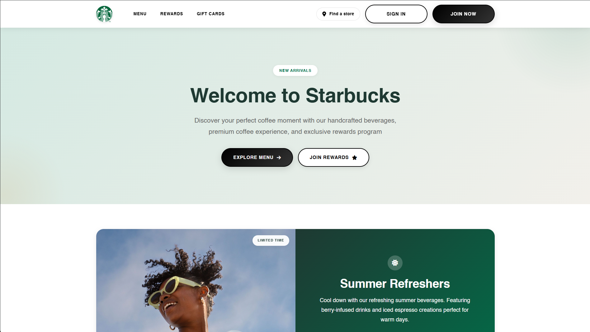

# Starbucks Homepage Clone

A basic front-end clone of the Starbucks homepage built using HTML and CSS. This project replicates the layout and visual style of the original site to practice responsive web design and CSS styling.

## 🛠️ Technologies Used
- HTML5  
- CSS3  
- Flexbox  
- Google Fonts

## 🚀 How to Use
1. Download or clone the repository.
2. Open the `index.html` file in your browser to view the project.

## Live Demo
[Starbucks][https://mr-1124.github.io/Basic-Starbucks-Clone-HTML-CSS/]

## 📸 Screenshots

## 👨‍💻 Author
Mayan Roy
